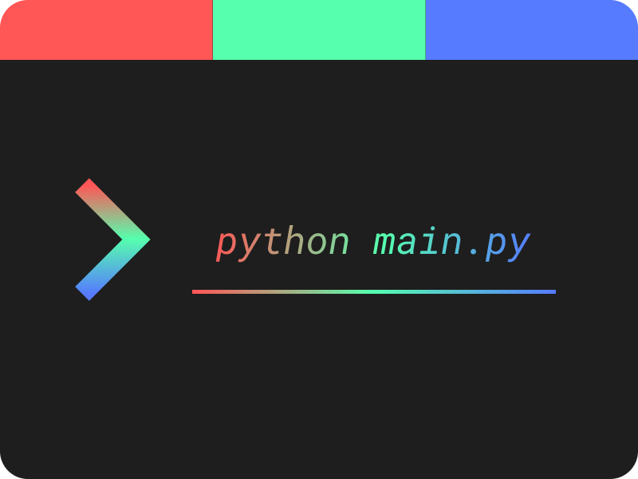
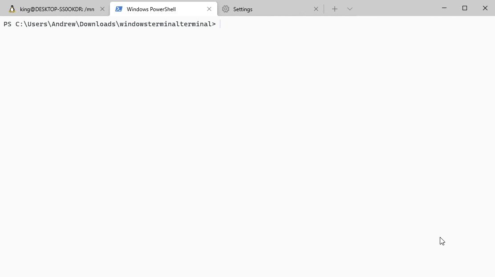

<p align='center'>
    
</p>

<h1 align='center'>WindowsTerminalTerminal</h1>

<h3 align='center'>Automatic installation of the new Windows Terminal themes.</h3>



### Notice!
I do not take credit for the themes. The themes all come from the amazing people at [this repo](https://github.com/atomcorp/themes). This project would not be possible without them. Much love ❤️.

## Installation Process
From source
1. Clone this repo
2. Install dependencies ``pip install -r requirements.txt``
3. Run the program ``python main.py`` 


Route 2 *Still not setup yet.*
1. Install the [PyPi Project]().
2. Run the project

## Contributions
```python
# No one has contributed.
```

### How to contribute
- Fork/Clone this repo
- Make your changes
- State your changes in **CHANGELOG.md** as the current version number + your username. (Ex: Bob would make ``1.0.0-bobthecoder``)
- Submit a pull request.

**tip: follow the .prettierrc rules or convert your code to match it by installing Prettier on Visual Studio Code**

## Known Bugs
```python
- [❎ - Unresolved] Unable to load Windows Terminal Configuration file.
```

## ToDo List
- [ ] Automatic Updating
- [ ] Visualization of themes
- [ ] **custom-colour-schemes.json**
